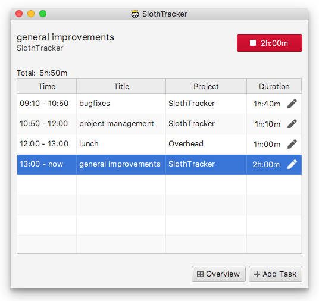

# SlothTracker's Issues Tracker

This is [SlothTracker's](https://www.royalsloth.eu) official issue tracker.

SlothTracker is a cross platform time tracking application that works
on Windows, Mac and Linux.

**Features:**

- Intelligent Autocomplete: input fields are autocompleting based on previous input

- Overlap Detection: Automatically detects and informs you about overlapping tasks

- Keyboard shortcuts: all possible actions are bound to keyboard shortcuts

- Detailed Reports: display, filter, rename and analyze past tasks

- Data import: import data from other time trackers (e.g: Clockify, Toggl, Harvest,Kimai, etc...)

- Data export: export tracked tasks in csv

- Total data privacy

- Desktop time tracking application: no internet connection needed

 

See [https://www.royalsloth.eu](https://www.royalsloth.eu) for more info.

 
 

## Linux

    

## Windows

    

## Mac

    

